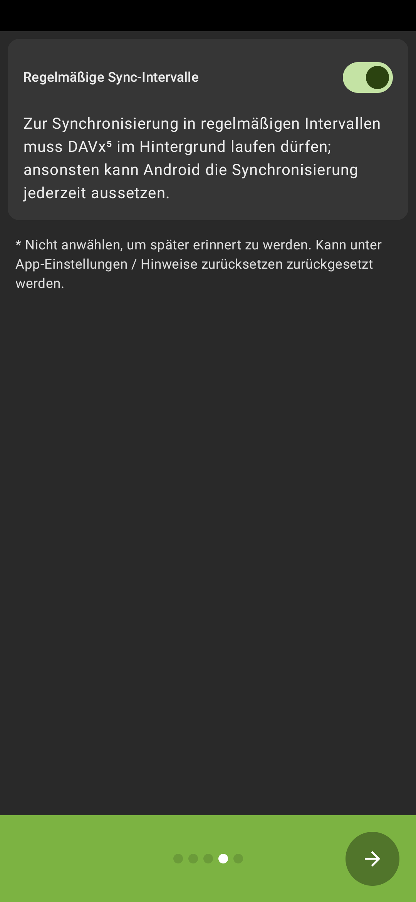
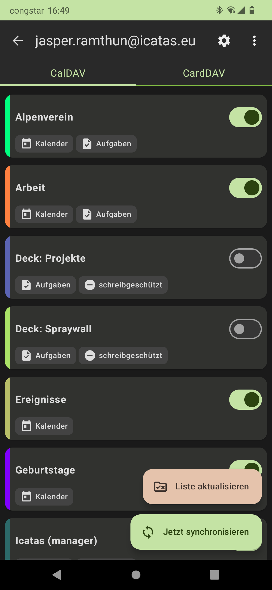

# Einbindung Nextclouddineste auf Android

## Inhalt

Dieser Guide bechreibt, wie sich die folgenden Dienste der Nextcloud unter Android nutzen lassen:

1. Zugriff auf Dateien
2. Automatischer Fotoupload
3. Kalender und Kontakte (Adressebücher)
4. Zugriff auf KeePass Datenbank

## 1. Zugriff auf Dateien: Installation und Einrichtung der Android Nextcloud App

Einen Zugriff auf die Dateien (Files) aus der Nextcloud ermöglicht die Nextcloud App für Android.

1. Herunterladen und Installieren:

	Lade die Nextcloud App aus dem Google Playstore herunter und installiere sie, indem du auf den
	*Installieren* Button tippst (Abb. 1.1 links): 

	https://play.google.com/store/apps/details?id=com.nextcloud.client

2. Serveradresse eingeben:

	Öffne die App und tippe auf *Anmelden*. Um dich mit der Icatas Nextcloud zu verbinden gibt die
	folgende Serveradresse ein (Abb. 1.1 mitte/rechts):

	https://cloud.icatas.eu

	Klicke auf den Pfeil am rechten Rand des Eingabefeldes um zum nächsten Schritt zu gelangen.

	 
	

	
	
	
	
**Abbildung 1.1**

	

	 

3. Anmelden:

	Es erscheint eine Sicherheitswarnung. Hier auf *Anmelden* tippen (Abb. 1.2 links).

	In der erscheinden Anmeldemaske müssen die persönlichen Anmeldedaten eingetragen werden, (Abb. 1.2
	mitte), die auch für die Anmeldung im Browser benötigt werden. Bei unekanntem Nutzernamen
	oder vergessenem Passwort kontaktiere einen Adminstrator.

	 
	

	
	
	
	
**Abbildung 1.2**

	

	 

	Bei erfolgreichem Log-In erscheit ein weiteres Fenster (Abb. 1.2 rechts). Tippe hier auf *Grand
	Access* um der App auf deinem Android Gerät dauerhaften Zugriff auf deine Nextcloud Dateien zu geben.

4. Öffnen der App

	Bei erneutem Öffnen der App wird nun der Filebrowser mit deinen Daten aus der Nextcloud gezeigt.
	Beachte, dass die Daten, sofern nicht schon anders eingestellt, virtuell vorhanden sind und erst
	beim Öffnen heruntergeladen werden.

## 2. Automatischer Fotoupload: Mit Nextcloud App Bilder automatisch in Cloud sichern

Die Nextcloud Android App ermöglicht einen automatischen Upload von Fotos in einen Order in der Cloud.
Die Installation und Einrichtung der App wird unter 1. beschrieben. Wenn die App auf deinem Gerät
istalliert ist, gehe wie folgt vor:

1. Öffne die Nextcloud Android App und tippe auf das Hamburger Menü am oberen Bildschirmrand (Abb.
2.1 links).

2. Tippe auf *Einstellungen* (ggf. nach oben wischen, Abb. 2.1 mitte).

3. Tippe auf *Automatisches Hochladen*. Der Punkt ist unter der kleinen blauen Überschrift *Mehr* zu
finden (Abb. 2.1 rechts). 

	 
	

	
	
	
	
**Abbildung 2.1**

	

	 

4. Hier kannst du nun den Ordner auswählen, der von deiner Kanera verwendet wird. In diesem Fall ist es
der Ordner *Camera*, auf einem anderen Gerät kann dieser Ordner aber auch einen anderen Namen haben.
Klicke zum Einrichten auf die drei Punkte (Abb. 2.2 links) und im aufploppenden Menü auf *Einrichten* 
(Abb. 2.2 mitte).

	 
	

	
	
	
**Abbildung 2.2**

	

	 

5. Im erscheinenden Pop-Up Fenster zunächst den Automatischen Upload durch tippen auf den Schalter
oben rechts aktivieren (grau = Ausgeschaltet, blau = Eingeschaltet, vgl. Abb. 2.3)

	 
	

	
	
	
**Abbildung 2.3**

	

	 

6. Nun können die weiteren Einstellungen getroffen werden. Hier eine Erklärungen:

	- *Remote-Ordner*: Hier kann der Ziel Ordner in der Cloud festgelegt werden (nicht der Ordner
	auf deinem Gerät), in dem die Fotos gespeichert werden.
	- *Unterordner benutzen*: Wenn du diesen Haken setzt, werden die Bilder im zuvor ausgewählten Ordner
	in Unterordnern nach Jahren abgelegt. Wird der Haken gesetzt kann auch noch eine monatsweise
	Speicherung ausgewählt werden.

7. Anschließend auf *Speichern* tippen um den Upload zu aktivieren. Ggf. erhälst du ein Pop-Up
*Batterie-Optimierung*. Hier auf *Deaktivieren* klicken um die Funktion des Uploads zu gewährleisten.
Dies nimmt die Nextcloud App und die mit dem Upload verbunden Hintergrundprozesse von den
Maßnahmen der Batterie Optimierung aus.

## 3. Kalender und Kontakte: Installieren und Einrichten des CalDAV / CardDAV Android Clients

Die in der Nextcloud angelegten Kalender und Adressbücher lassen sich mit Hilfe des Protokolls
*Cal-* bzw. *CardDAV* auch auf einem Android Gerät verwenden (lesend/schreibend). Dafür wird ein CalDAV Client
benötigt.

1. Installiere den Android CalDAV Client *DAVx⁵ - CalDAV CardDAV WebDAV* des Entwicklern bitfire web 
	engineering herunter. Diese kann entweder 

	- kostenpflichtig über den Google Play Store (Abb. 3.1 links)
	- kostenfrei über den freien Android App Store F-Droid (Abb. 3.1 rechts)
	
	heruntergeladen und installiert werden. Hier findest du eine Anleitung wie man F-Droid installiert.

	 
	

	
	
	
**Abbildung 3.1**

	

	 

2. Nach dem ersten Öffnen der App erscheint ein grüner Bildschirm (Abb. 3.2 links). Tippe auf den 
kleinen Pfeil unten rechts um mit der Einrichtung zu starten.

3. Wahle alle Berechtigungen aus, wenn du Kalender und Kontakte syncronisierne möchtest (vgl. Abb. 3.2
mitte). Ggf. kann auch nur das Benötige ausgewählt werden. Tippe auf den Pfeil. Hier kann bei
Bedarf auch die Syncronisierung der Aufgaben (Tasks) aktiviert werden. In diesem Fall beschränken
wir uns auf Kalender und Adressbücher.

	 
	

	
	
	
	
**Abbildung 3.2**

	

	 

4. Auf der nächsten Seite erscheint ein Pop-Up *Soll die App immer im Hintergrund ausgeführt werden?*.
Hier zwingend *Zulassen* auswählen (Abb. 3.3 links).

5. Auf der folgenden Seite *Regelmäßige Sync-Intervalle* auswählen (Abb. 3.3 mitte).

	 
	

	
	
	
	
**Abbildung 3.3**

	

	 

6. Falls du *DAVx⁵* kostenlos nutzt, z.B. über F-Droid, hast auf dieser Seite die Möglichkeit mit
einer Spende zum weiteren Bestehen des Projektes beizutragen (Abb. 3.3 rechts). 

7. Nun öffnet sich der Hauptbildschirm der App. Tippe unten rechts auf *Konto anlegen* (Abb. 3.4 links).

8. Wähle unter *Nextcloud* aus und tippe auf *Fortfahren* (Abb. 3.4 mitte).

	 
	

	
	
	
	
**Abbildung 3.4**

	

	 

9. Es erscheint eine Eingabemaske für eine Serveradresse. Um sich bei der Icatas Nextcloud anzumelden
tippe die folende Serveradresse ein:

	https://cloud.icatas.eu

	und tppe auf *Anmelden*.

10. Es öffnet sich ein Browser-Fenster. Tippe hier auf Log-In (Abb. 3.5 links) und melde dich mit
deinen persönlichen Log-In Daten an. Verwende die selben Daten wie zum Anmelden bei der Nextcloud im
Browser. Gewähre anschließend deinem Android Gerät dauerhaften Zugriff auf dein Nextcloud Konto indem du
auf den Buttom *Grand access* tippst (Abb. 3.5 mitte).

	 
	

	
	
	
	
**Abbildung 3.5**

	

	 

11. Wenn die Anmeldung erfolgreich war erscheint *Account connected*. Tippe nun auf as X oben links (
Abb. 3.5 rechts) um zum Einrichtungsassistenten zurück zu gelangen.

12. Gibt unter *Konto hinzufügen* eine E-Mail Adresse als Nutzernamen ein. Diese E-Mail Adresse muss nicht
mit deiner Nextcloud verbunden sein.
	 
	

	
	
	
	
**Abbildung 3.6**

	

	 

13. Tippe auf *Konto anlegen*. Auf der nächsten Seite kann zwischen den Reitern *CalDAV* und *CardDAV*
ausgewählt werden (Abb. 3.6 mitte/rechts) und die gewünschten Kalender und Adressebücher können für die 
Syncronisation ausgewählt werden. Tippe auf *Jetzt syncronisieren*, damit die Kalender und Adressbücher
in den entsprechenden Kalender und Kontakt Apps verfügbar sind.

	 
	

	
	
	
**Abbildung 3.7**

	

	 

14. Wenn alles gekappt hat, sollten die Adressbücher in der Kontaktapp deines Geräts wie in Abb. 3.7
neben mind. einem weiteren Google-Konto als *DAVx⁵-Adressbuch* unter *Konten* auftauchen. Die Einbindung
in deine Kalender-App kann je nach App etwas unterschiedlich aussehen. In der hier verwendeten App
muss die CalDAV Syncronisation noch in den Einstellungen aktiviert werden, ansonsten sollten die
in Schritt 13 ausgewählten Kalender hier verfügbar sein.

## 4. Zugriff auf KeePass Datenbank unter Android

Unter Android kann über eine App auf die Keepass Datei in der Nextcloud zugegriffen werden. Dafür muss
die Nextcloud Client App installiert und eingerichtet werden (Abschnitt 1).

1. Installiere die App KeePass XC.

2. Öffne die Nextcloud App, navigiere in das Verzeichnis deiner KeePass Datei und tippe zum öffnen auf
die Datei. Es erscheint ein Pop-Up zum Auswählen einer passenden App. Wähle hier die installierte App
KeePass XC aus. 

3. Du kannst nun auf deine Passwörter zugreifen (auch offline, da die Datei heruntergeladen wird).
Falls sich deine KeePass Datei ändert, bspw. weil an einem anderen Gerät ein Eintrag hinzugefügt wurde,
musst du die Datei erneut über die Nextcloud App öffnen, damit die aktuelle Version heruntergeladen wird.

