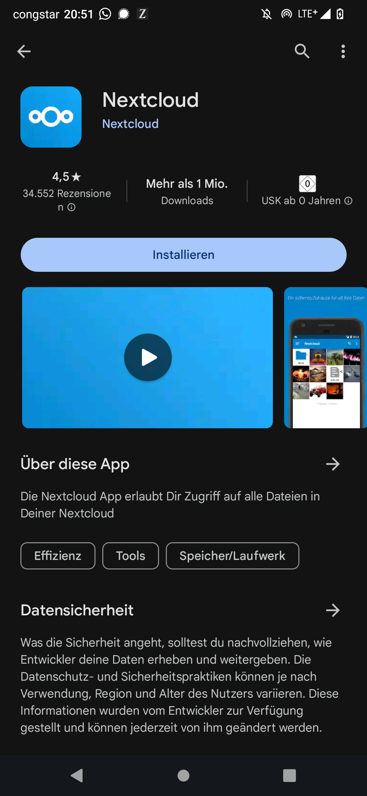
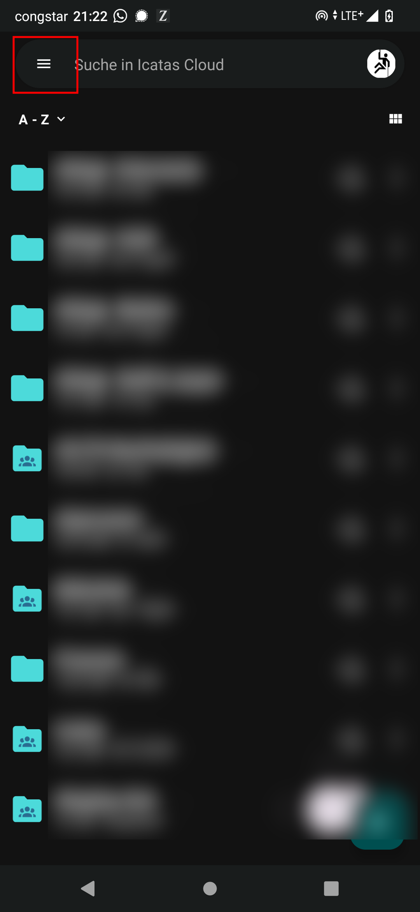
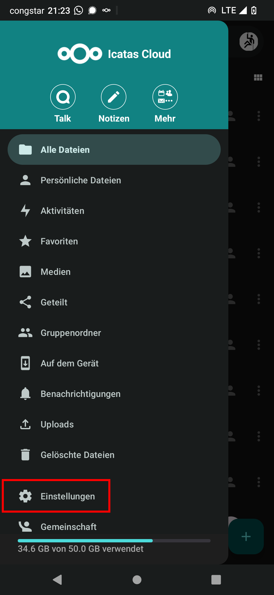

# Einbindung Nextclouddienste auf Android

## Inhalt: 

Diser Guide beschreibt wie sich die folgenden Dienste der Nextcloud unter Android nutzen lassen:

```
1. Zugriff NC Dateien in der Nextcloud
2. Einrichten des automatischen Fotouploads
3. NC Kontakte mit dem Android syncronsieren
4. NC Kalender mit Android syncronsieren
```


## 1. Dateien: Installation und Einrichtung der Android Nextcloud Client App

Zugriff auf die Dateien ("Files") aus der Nextcloud ist über die den Nextcloud Android Client möglich.


Voraussetzungen:

	- Android Version ..
	- Stabile Internet Verbindung (am besten WLAN)

1. Installieren der Nextcloud Android App

 - Lade die Nextcloud App über den Google Playstore herunter und installiere sie
indem du auf den Installieren Button klickst (Abb. 1.1 links)

		https://play.google.com/store/apps/details?id=com.nextcloud.client

2. Anmelden

 - Öffne die App und klicke auf "Anmelden". Es erscheint ein Eingabefeld. Gib hier
die folgende Adresse ein um dich bei der Icatas Cloud anzumelden:
	
	**https://cloud.icatas.eu**

 - Klicke auf den Pfeil am rechten Ende des Eingabefeldes um zum nächsten Schritt
 zu gelangen.
			
	<br />
	<center>
	
	
	
	<p> **Abbildung 1.1:** links: App im Google Playstore, mitte/rechts: Ersten Schritte nach erstem Öffnen der App.
	</center>
	<br />

3. Es erscheint eine neue Seite. Hier auf "Anmelden" klicken (vgl. Abb. 1.2 links).

4. In der erscheinenden Anmeldemaske musst du deine Anmeldedaten eingeben (Abb. 1.2, mitte), die
du auch bei der Anmeldung über den Browser am Computer verwendest. Beachte, dass
dein Benutzername hier i.d.R. keine E-Mail Adresse ist. Falls du deinen Nutzernamen
und / oder dein Passwort vergessen hast melde dich  .....

	<br />
	<center>
	
	
	
	<p> **Abbildung 1.2:** links: Sicherheitswarnung nach Eingabe der Serveradresse, mitte: Eingabemaske
		persönliche Anmeldedaten, rechts: Bestätigung des Zugriffs deines Gerätes auf deine Daten
	</center>
	<br />

5. Bei erfolgreichem Log-In sollte ein weiteres Fenster erscheinen (Abb. 1.2 rechts). Klicke hier
auf "Grand  Access" um deinem Android Client den dauerhaften Zugriff auf deine Daten
zu gestatten.

6. Nach erfolgreicher Anmeldung erscheint ggf. ein Pop-Up, mit der Auswahlmöglichkeit der App entweder
den "vollern Zugriff"  oder "Medien Schreibgeschützt" zu wählen.

7. Beim Öffnen der App öffnet sich nun der Filebrowser und die Dateien aus deiner
Nextcloudablage. 

## 2. Automatischen Fotoupload einrichten

Wenn du möchtest, dass deine Fotos, die du mit dem Smartphone machst, automatisch
in der Nextcloud gespeichert werden, kannst du die Funktion "Automatisches Hochladen" der Nextcloud
Client App verwenden. Dazu gehe wie foglt vor:

1. Öffne den Nextcloud Client (die App) und tippe auf das Hamburger Menü am 
oberen Bildschirmrand (vgl. Abb 2.1 links).

2. Tippe auf "Einstellungen" (ggf. nach oben Wischen, vgl. Abb. 2.1, mitte)

	<br />
	<center>
	
	
	
	<p> **Abbildung 2.1:** links: Position Hamburg Menü, mitte: Die Einstellungen sind unten zu finden,
		rechts: "Automatisches Hochladen" ist unter "Mehr" zu finden.
	</center>
	<br />

3. Tippe auf "Automatisches Hochladen. Der Punkt ist unter der kleinen blauen 
Überschrift "Mehr" zu finden (Abb. 2.1, rechts)

4. Hier kannst du nun den Order auswählen, der von deiner Kamera verwendet wird.
In diesem Fall ist es der Ordner "Camera" Klicke zum Einrichten auf die drei Punkte
und im aufploppenden Menü auf "Einrichten".

5. Im erscheinenden Pop-Up Fenster zunächst den Automatischen Upload durch tippen
auf den Schalter oben rechts.

6. Nun können die weiteren Einstellungen getroffen werden. 

	- "Remote-Order": Hier kann der Ziel Ordner in der Cloud festgelegt werden, in
dem die Fotos gespeichert werden
	- "Nur über gebührenfreies WLAN hochladen": Wenn der Haken gesetz ist, werden
die Bilder nur bei einer Verbindung mit einem WLAN Netz hochgeladen. Wenn der Upload
auch über Mobile Daten erfolgen soll, Haken nicht setzen
	- "Nur während des Ladens der Batterie hochladen": selbsterklärend
	- "Vorhandene Dateien ebenfalls hochladen" : Wenn du möchteset, dass auch
alle Bilder hochgeladen werden, die du bereits gemacht hast, Haken setzen
	- "Unterordner benutzen": Wenn du diesen Haken setzt, werden die Bilder
entsprechend dem Aufnahmedatum in Order sortiert. Ist der Haken gesetzt, erscheint
eine weitere Option, über die festgelegt werden kann, ob nur ein Ordner pro Jahr,
oder weitere Unterordner für jeden Monat oder sogar jeden Tag angelegt werden sollen.
	- "Originaldatei wird...": Wenn du möchtest, dass die Fotos nur als Sicherheitskopie
in der Cloud abgelegt werden sollen, kannst du hier "im Orginalordner behalten..." auswählen.
Alternativ kannst du "in den App-Ordner verschoben" auswählen. Dann liegen die Bilder
statt im Kamera-Ordner nur noch in der Cloud, der entsprechende Order ist aber "heruntergeladen"
und offline in deiner Galerie App verfügbar. Wählst du "gelöscht" aus, werden die Daten
nur in die Cloud hochgeladen und sind nicht ohne weiteres Zutun offline verfügbar, sobald
der Upload abgeschlossen ist.
	- "Was tun, wenn die Datei bereits vorhanden ist?": kann auf standard gelassen werden...

7. Anschließend auf "Speichern" tippen um den Upload zu aktivieren. Ggf. erhälst
du ein Pop-Up "Batterie-Optimierung". Hier auf "Deaktivieren" klicken um die 
Funtkion des Autouploads zu gewährleisten.


j