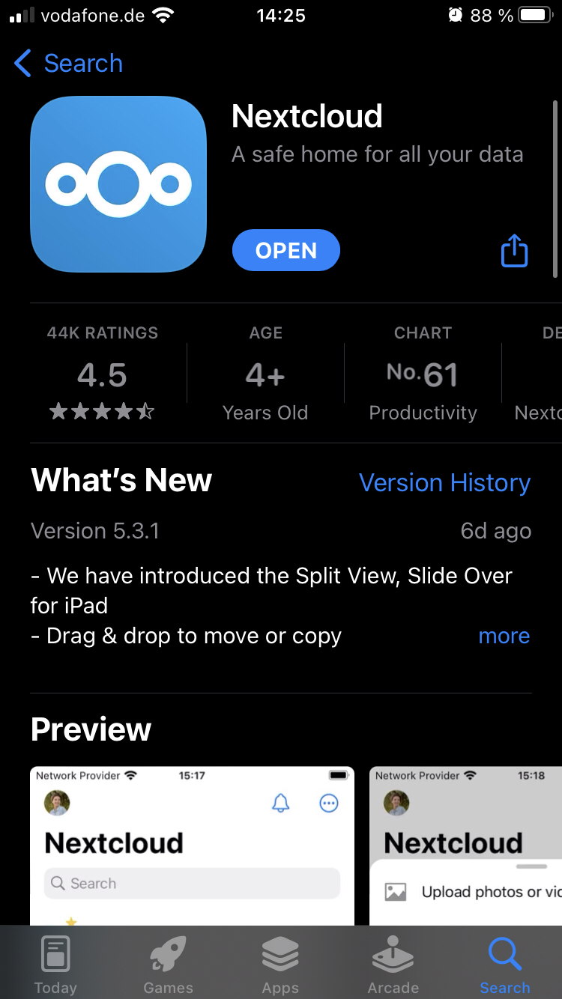
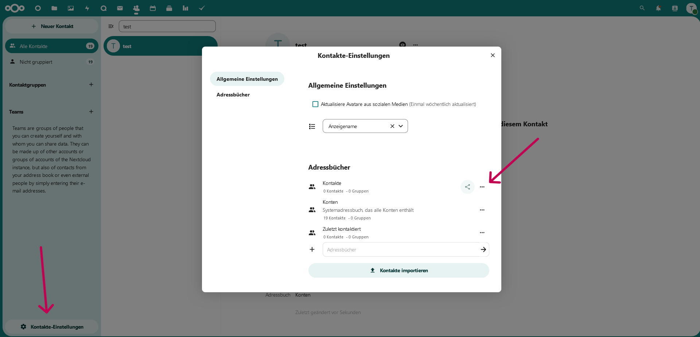
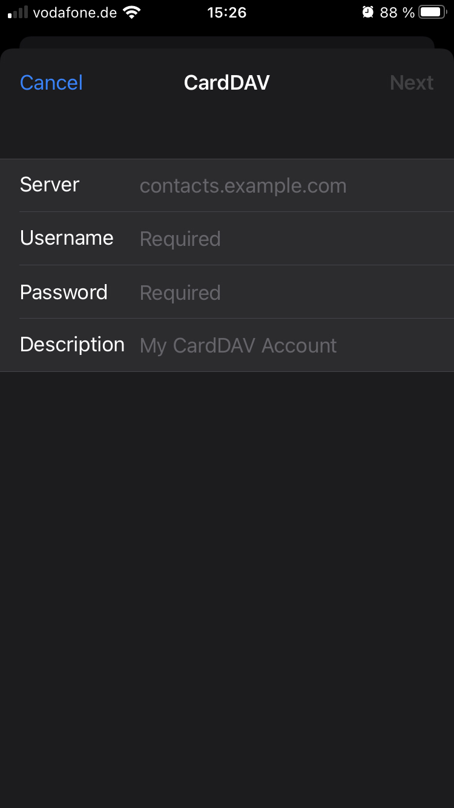
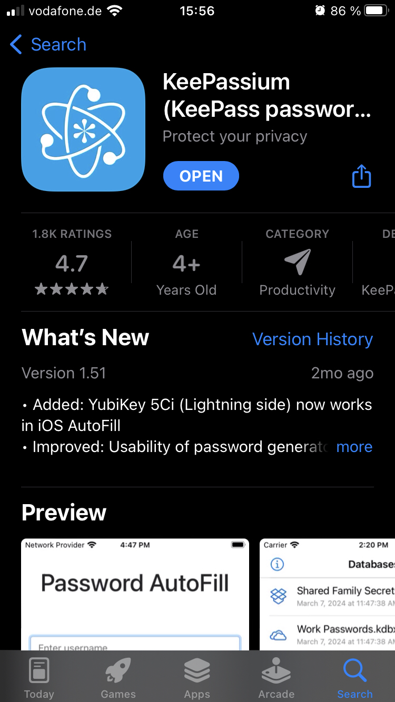
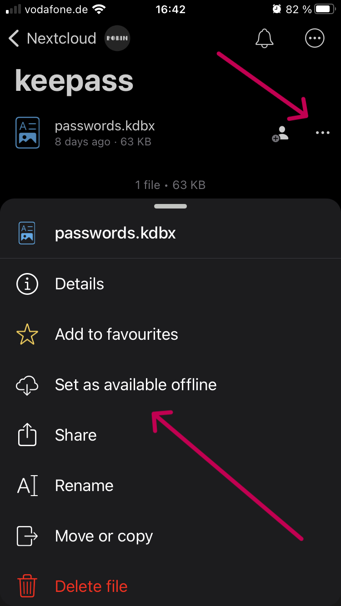
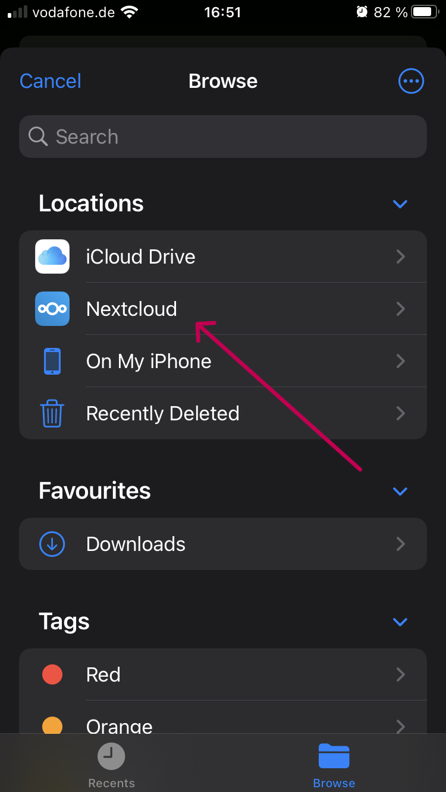
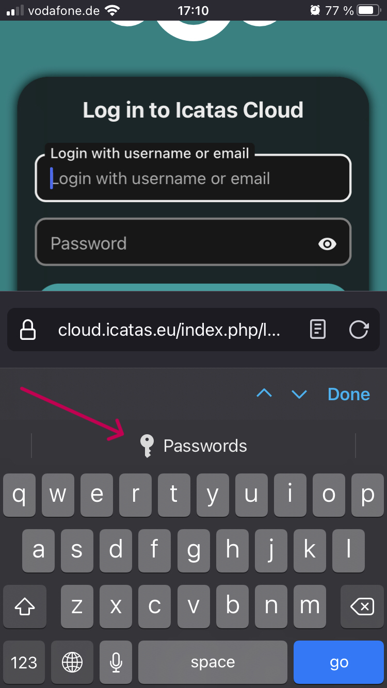

# Nextcloud unter IOS einrichten
Dieser Artiekel soll einen kurzen Überblick darüber geben, wie sich die Nextcloud zusammen mit ausgewählten Tools unter IOS nutzen lässt.

## Installation
Als erstes sollte dazu die Nextcloud App aus dem [AppStore](https://apps.apple.com/de/app/nextcloud/id1125420102) installiert werden. 

Anschließend kann die App geöffnet werden. Das erste was man nun zu sehen bekommt, ist der Login Screen.
Über diesem kann man sich über Eingabe der URL mit einem der vielen Nextcloud Servern verbinden.
In unserem Fall ist das die URL **https://cloud.icatas.eu**.
Nun wirst du auf die Webseite der Nextcloud weiter geleitet.
Hier musst du deinen Benutzernamen (vorname.nachname) und dein Passwort eingeben.
Ist dies Erfolgreich, wirst du in die App weiter geleitet 

## Dateien
Bist du Erfolgreich eingeloggt, kannst du hier alle deine und dir von anderen geteilten Dateien einsehen.

## Kontakte
Das Synchronisieren der Kontakte von IOS zur Nextcloud, erlaubt es dir alle deine Kontakte immer im selben Zustand auf deinem iPhone und der Nextcloud zu haben. 
Der einfachste Schritt dies zu erreichen, erfolgt im ersten Schritt über die [Nextcloud Webseite](https://cloud.icatas.eu/index.php/apps/contacts) über den Tab Kontakte (Eng. Contacts).
Hier kann im unterem linken Bereich auf das Zanrad `Kontakte-Einstellungen` (Eng. `Contact settings`) geklickt werden.
In dem sich nun öffnendem Fester erscheint eine Übersicht der vorhandenen Adressbücher.

Hier kann nun über die drei horizontalen Punkte neben dem gewünschtem Adressbuch (im Normalfall sollten das die normalen Kontakte sein) über `Link kopieren` der für IOS notwendige Link kopiert werden.
Am besten schickt man sich diesen, über einen Massanger seiner Wahl direkt zu seinem iPhone.

Anschließend kann auf dem iPhone die `Settings` App gestartet werden. Dort nach unten zum Punkt `Kontakte` Scrollen und unter `Konten` auf `Neues Konto Hinzufügen` gehen.
Anschließend wird `Anderes` und `CardDav Konto` gewählt.

Im Englischen würde die Kette wie folgt aussehen: `Settings`>`Contacts`>`Accounts`>`Add Account`>`Other`>`Add CardDAV Account`

Hier wird unter `Server` der vorher kopiert und mit dem Messanger an das Handy geschickte Link aus der Nextcloud eingefügt.
Unter `Benutzername` und `Passwort` werden die bekannten Einlogdaten zur Nextcloud eingegeben.
Für die `Beschreibung` kann z.B. `Kontakte Nextcloud Icatas` gewählt werden, das bleibt aber dir überlassen.

Nun sollten in der `Kontakte App` das hinzugefügte Adressbuch sichtbar sein.
Probiere es am besten gleich mal aus und füge einen neuen Kontakt hinzu. Dieser sollte, nach kurzem warten, dann über die [Webseite der Nextcloud](https://cloud.icatas.eu) im Tab `Kontakte` erscheinen.  

## Passwortmanager - Passwörter mit KeePass synchronisieren
Ein großen Problem der Digitalen Welt ist es, dass wir immer mehr Konten mit unterschiedlichen Passwörtern haben.
Eine hervorragende Lösung dabei nicht den Überblick zu verlieren und dabei eine große Sicherheit zu gewährleisten, ist ein lokaler Passwortmanager.
Ein solcher Passwortmanager ist KeePassXC. Für weitere Informationen zu sicheren Passwörtern und zu KeePass schaue in unseren Wikieintrag [LINK].

Unter IOS lässt sich KeePass am besten mit der App [KeePassium](https://apps.apple.com/us/app/keepassium-keepass-passwords/id1435127111) nutzen.

### Du besitzt noch keine KeePass Datei
Siehe dir in unser [Anleitung]() **TODO: Link Hinzufügen** an wie du dir KeePass zusammen mit der Nextcloud einrichtest.
Hast du dies bereits erledigt, kannst du im nächsten Abschnitt weiter machen.

### Du besitzt bereits eine KeePass Datei
Öffne die Nextcloud App auf deinem iPhone und navigiere dort in den Ordner mit deiner KeePass Datei. Beispielhaft der Ordner `kepass` in dem sich die Datei `passwords.kdbx` befindet.

Über die drei horizontalen Punkte kannst du das Kontextmenü öffnen und über `Offline Verfügbar machen` (Eng. `Set as available offline`) dafür sorgen, dass die Datei auch ohne Internetverbindung auf dem iPhone verfügbar ist.
Anschließend kannst du die KeePassium App öffnen.

Nun wird Keepassium geöffnet und im Hauptmenü über das `Kreuz` in der oberen rechten Ecke `Daten Bank öffnen` (Eng. `Open Database`) gewählt. Jetzt öffnet sich der Filemanager von deinem iPhone. In der Regel öffnet sich iCloud als erstes.
Da wir dort aber nicht hin wollen, müssen wir mit einem Klick auf `Durchsuchen` (Eng. `Browse`) in der oben linken Ecke noch auf die eine Ebene darüber.

Von hier aus gehen wir auf `Nextcloud` und suchen von hier wieder unsere Keepass Datei. Im Beispiel war diese unter `keepass`>`passwords.kdbx`. Jetzt hätten wir den Schritt geschafft, das wir auf alle unsere Passwörter aus der App Zugreifen können.
Im nächsten Schritt wird noch erklärt, wie man Passworteingaben im Browser (z.B. Safari oder Firefox) automatisch mit KeePassium füllen kann.

### Automatische Passworteingabe
Gehe auf deinem iPhone unter `Einstellungen`>`Passwörter`>`AutoFill Passwords` und aktiviere die Option `AutoFill Passwords` und wähle als Quelle KeePassium aus.
Nun kannst du im Browser (z.B. Safari oder Firefox) eine Webseite öffnen zu dem ein Password in deiner KeePass Datenbank liegt.
Es sollte beim Anklicken über der Tastatur ein Schlüssel Symbol erscheinen.
Beim klicken darauf wirst du an KeePassium weiter geleitet und kannst dich nach dem Entsperren darüber freuen das dein Passwort automatisch in die Felder gefüllt wurde.

## Anmerkung des Autors
Alle hier vorgestellten Tools sind nicht Alternativlos.
Es wird jedoch versucht einen möglichst einfachen Einstieg in ein bewussten und vor allem sicheren Umgang mit der Cloud zu ermöglichen.
Bei der Auswahl liegt der Fokus darauf, möglichst Free Source Software mit einem hohen Anspruch an die Datensicherheit und Datenhoheit zu erlangen.
Sie sollen durchaus die Möglichkeit bieten auch Langfristig und Zuverlässig genutzt werden zu können, es bedarf jedoch wie bei allen Dingen einer gewissen Pflege.
